This repository discusses image augmentation using the Blender software package.

Projects starts with 3d model of stop sign. In this project it consists of 3 elements: rod, holder and sign. 3D models for these elements are shown at the image below:

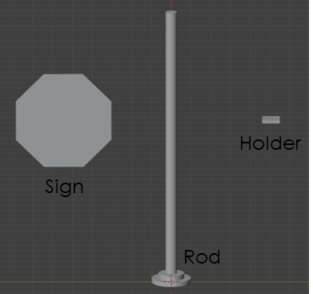

Textures which are used for stop sign are shown at image below

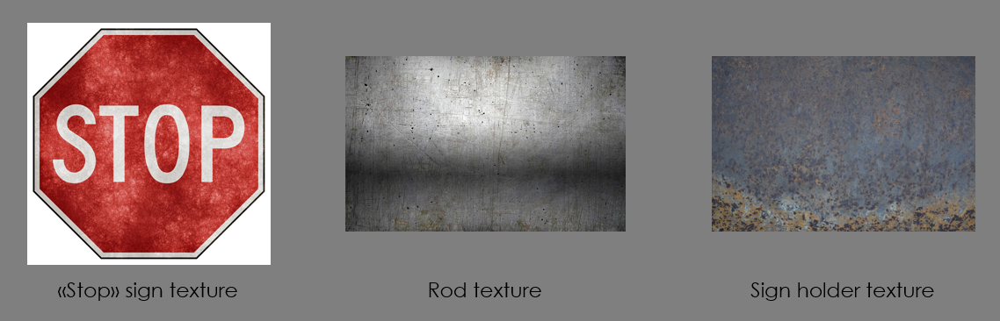

Finally after UV wrapping and texturing we get the sign like at the image below. Link to [stop_sign.blend](https://drive.google.com/file/d/1NKDwhMdH9LwvWwnDTGjfGaqBBLzUUZxc/view?usp=sharing)

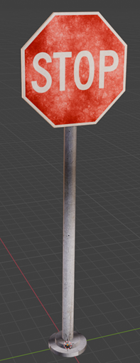

To diversify the data, the asset of the city is used, which is shown in the figure below

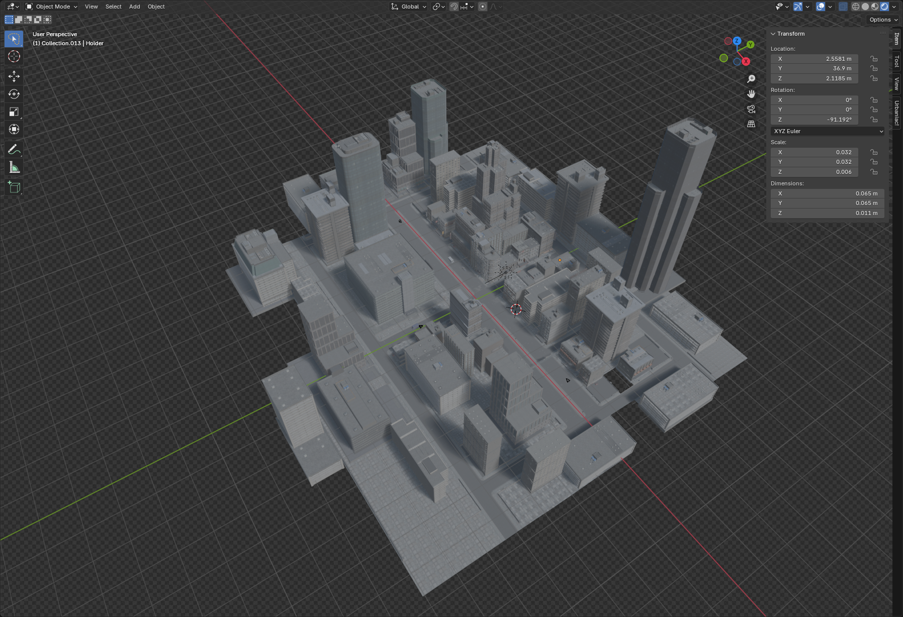

There are four cameras in the city from which data is collected for the dataset
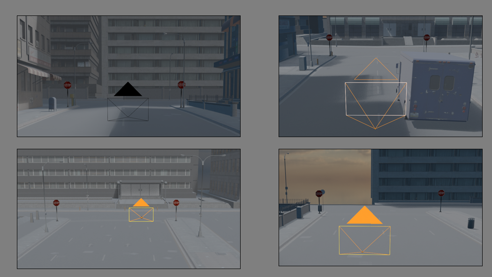

To diversify stop signs using next strategy, camera from initial position moving as close as possible to stop signs to see at least one stop sign along cosine or sine trajectory. With this strategy, dataset is enriched with different scale of stop signs and different background. It is also possible to play with randomly occurs objects at the scine, lights, camera settings. In this repository is considered only different positions of the cameras.

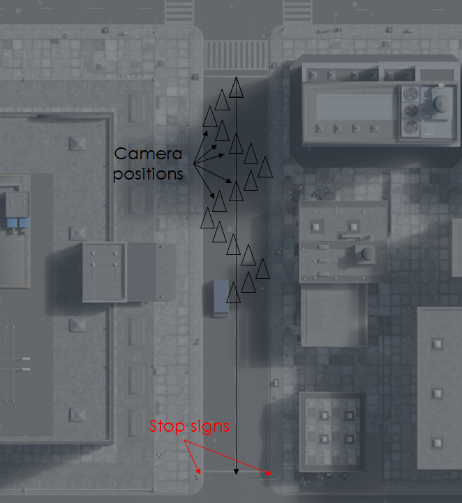

Script for collecting data and environment for data augmentation could be found in [environment3.blend](https://drive.google.com/file/d/1rhO7eQcW14oTVVJWqy8-RirnWppOIewx/view?usp=sharing)

.blend files should be located in *models* folder to check workability.

To distinct labels from other part of the scene, two images are made at one position of the camera: original and with turned off environment, except stop signs. These images are shown below

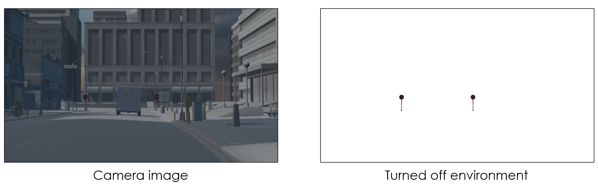


When all the data is collected the script [bbox_creator](bbox_creator.ipynb) is used to preprocess data and write dataset in COCO format.

```
{
    "images": [
        {
            "id": 1,
            "file_name": "image_001_0000.png",
            "height": 1080,
            "width": 1920
        }
    ],
    "annotations": [
        {
            "id": [
                1,
                2
            ],
            "image_id": [
                1,
                1
            ],
            "category_id": [
                1,
                1
            ],
            "bbox": [
                [
                    1053,
                    605,
                    34,
                    113
                ],
                [
                    551,
                    605,
                    34,
                    113
                ]
            ],
            "area": [
                3842,
                3842
            ],
            "iscrowd": [
                0,
                0
            ]
        }
    ],
    "categories": [
        {
            "id": [
                1,
                2
            ],
            "name": [
                "stop_sign",
                "stop_sign"
            ]
        }
    ]
}
```

In some cases/images stop signs are hidden by the object at environment, like at this image where stop sign is hidden by the van

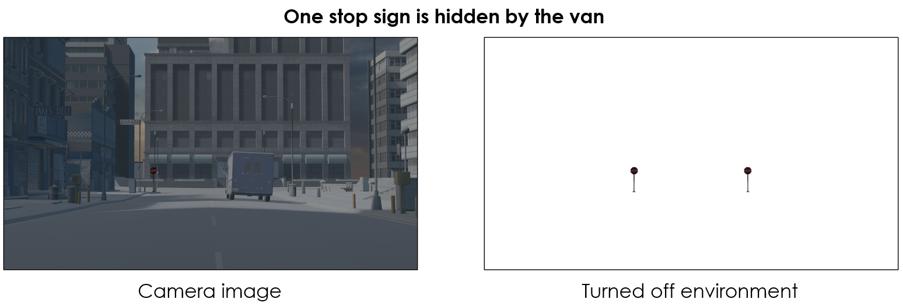

In this case to decide include to annotation stop sign or not, the mean values of stop sign mask in original image and label image calculate and compare. If the values are close then add stop sign and bbox to annotation rather not add. Comparing threshold is about 10.

```python

x, y, w, h = cv2.boundingRect(contour)
body = image[y:y+h,x:x+w]
body_label = label[y:y+h,x:x+w]
body_mask = mask[y:y+h,x:x+w]

masked_image = cv2.bitwise_and(body[:, :, :3], body[:, :, :3], mask=body_mask)
masked_image_label = cv2.bitwise_and(body_label[:, :, :3], body_label[:, :, :3], mask=body_mask)
mean_value_image = cv2.mean(masked_image[:, :, :3], mask=body_mask)
mean_value_label = cv2.mean(masked_image_label[:, :, :3], mask=body_mask)

distance = np.linalg.norm(np.array(mean_value_image[:3]) - np.array(mean_value_label[:3]))

if distance < 10:
    data["annotations"][i]["id"].append(j+1)
    data["annotations"][i]["image_id"].append(i+1)
    data["annotations"][i]["category_id"].append(1)
    data["annotations"][i]["bbox"].append([x, y, w, h])
    data["annotations"][i]["area"].append(w * h)
    data["annotations"][i]["iscrowd"].append(0)

    data["categories"][i]["id"].append(j+1)
    data["categories"][i]["name"].append("stop_sign")

```

Finally the dataset is written to [annotations.json](/models/annotations.json) and could be downloaded from google disk with images and labels [dataset](https://drive.google.com/file/d/1AC_F_T0-y_GM1RcIYGwcAOgCb_NrSfcu/view?usp=drive_link)

To check labels after preprocessing the code in the end of [bbox_creator](bbox_creator.ipynb) could be used.

```python
# Сохранение в файл
with open("models/annotations.json") as file:
    data = json.load(file)

im_path = data["images"][56]["file_name"]
image_path = "./models/data/images/" + im_path
image = cv2.imread(image_path)
image = cv2.cvtColor(image, cv2.COLOR_BGR2RGB)
plt.axis("off")
plt.imshow(image)  
```

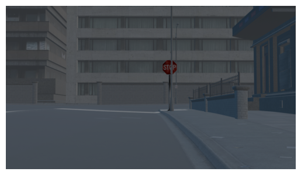

```python
# Сохранение в файл
bboxs = data["annotations"][56]["bbox"]
output_image = image.copy()

for x,y,w,h in bboxs:
    cv2.rectangle(output_image, (x, y), (x + w, y + h), (255, 0, 0), 2)

plt.imshow(output_image)
plt.axis("off")
plt.show()
```

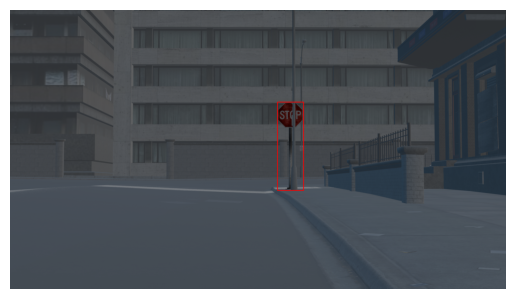


[YOLOv9](https://docs.ultralytics.com/ru/models/yolov9) was chosen for training on this dataset. https://github.com/ultralytics/yolov3/issues/102

Training dataset should has next structure

Here's a recommended dataset structure for training a YOLOv9 model:  

### **Dataset Directory Structure:**  
```
/dataset
    /train
        /images
            image1.jpg
            image2.jpg
        /labels
            image1.txt
            image2.txt
    /valid
        /images
            image3.jpg
            image4.jpg
        /labels
            image3.txt
            image4.txt
    /test (optional)
        /images
            image5.jpg
            image6.jpg
        /labels (optional)
            image5.txt
            image6.txt
    data.yaml
```

---

### **1. File Descriptions:**  

1. **Images Folder (`/images`)**: Contains training, validation, and optional test images in formats like `.jpg` or `.png`.  

2. **Labels Folder (`/labels`)**: Contains corresponding annotation files for each image in YOLO format (`image_name.txt`).  
   - Format:  
     ```
     <class_id> <x_center> <y_center> <width> <height>
     ```
   - All values are normalized between 0 and 1.  

3. **Data Configuration File (`data.yaml`)**: Describes the dataset.  

---

### **2. Example `data.yaml`:**
```yaml
# YOLOv9 dataset configuration
train: ./train/images
val: ./valid/images
test: ./test/images  # Optional

nc: 3  # Number of classes
names: ["class1", "class2", "class3"]
```

---

### **3. Sample Label File (`image1.txt`):**
```
0 0.45 0.55 0.2 0.3
1 0.5 0.4 0.1 0.15
```

---

Train parameters:
1. **batch** = 16 
2. **epochs** = 150
3. **img** = 640 Target image size for training. All images are resized to this dimension before being fed into the model. Affects model accuracy and computational complexity. 
4. **device** = 0 
5. **min-items** = 0 
6. **close-mosaic** = 15
7. **single-cls** = True

Training results:
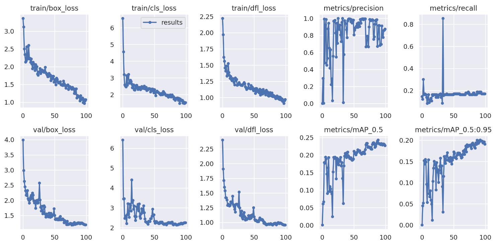

Prediction examples
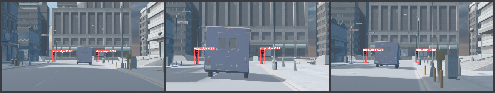